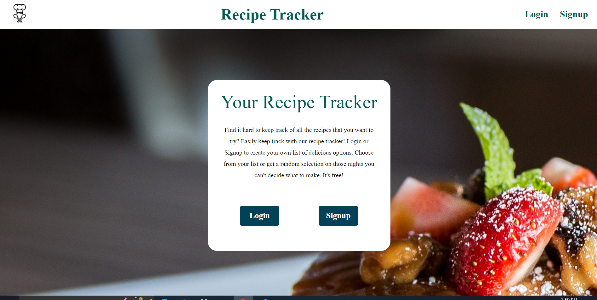

# Showlist / Movie Guide

 What's for dinner?

 
Description of project

Users can easily keep track of what Recipes they have added to their list and easily link to the websites. There is also a function that allows them to generate a random recipe. 

Full Website: 

## How It's Made:

**Tech used:** HTML, EJS, CSS, JavaScript, NodeJS, Mongodb

This is a fullstack web app running on NodeJS and Mongodb. Each recipe is stored as an individual object inside of a database, which can then be retrieved via the server's own web API. The front-end of the application uses EJS to dynamically render show data that the user retrieves. 

Random Recipe: Allows users that can't decide what to make for dinner to get a random selection from their collection.

# Packages/Dependencies used 

bcrypt, connect-mongo, dotenv, ejs, express, express-flash, express-session, mongodb, mongoose, morgan, nodemon, passport, passport-local, validator

---

# Install all the dependencies or node packages used for development via Terminal

`npm install` 

---

# Things to add

- Create a `.env` file and add the following as `key: value` 
  - PORT: 2121 (can be any port example: 3000) 
  - DB_STRING: `your database URI` 
 ---

## Lessons Learned:
Github version control can come in very handy. Communicating with your teamates also adds to success.

## Optimizations
Additional features:

- Allow users to build out a 'week' of meals

- Add a tags search feature so users can search their menu lists for specific meals such as 'Quick', 'Chicken' or 'Breakfast'
